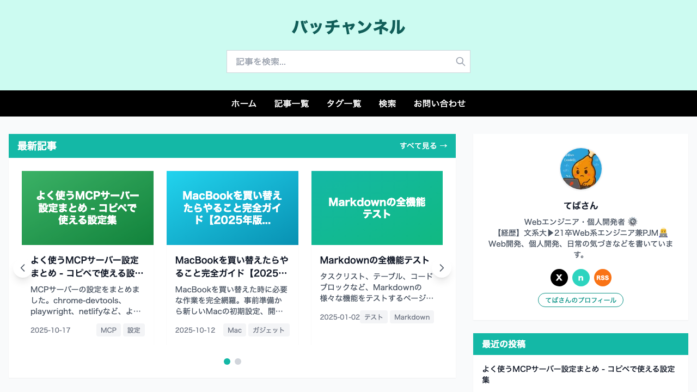
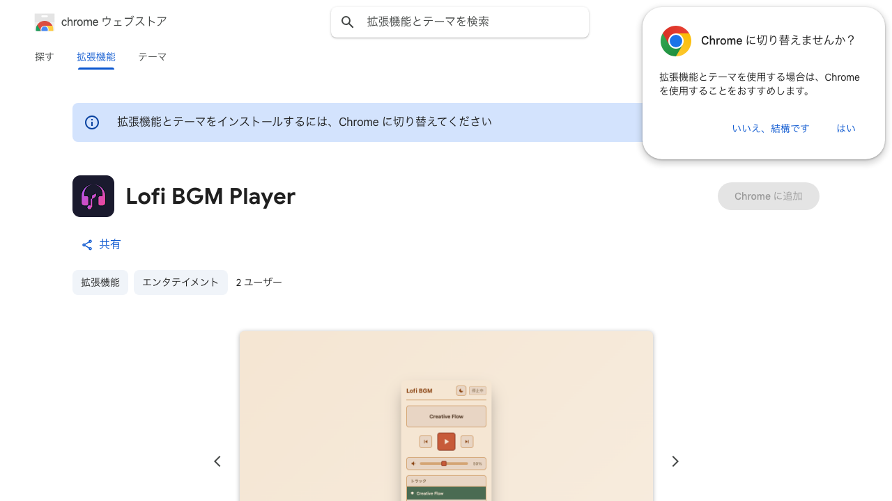
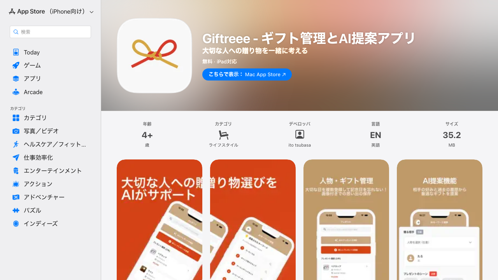
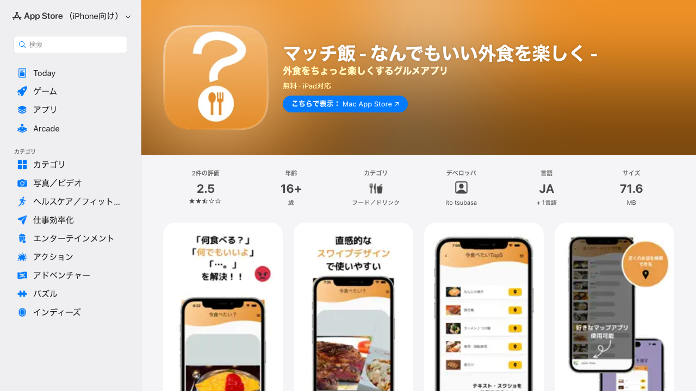
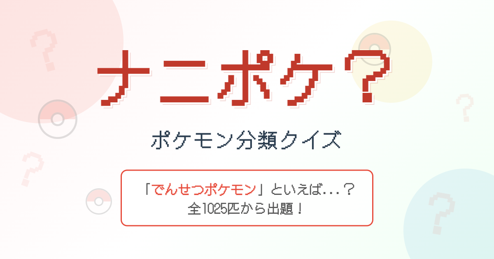
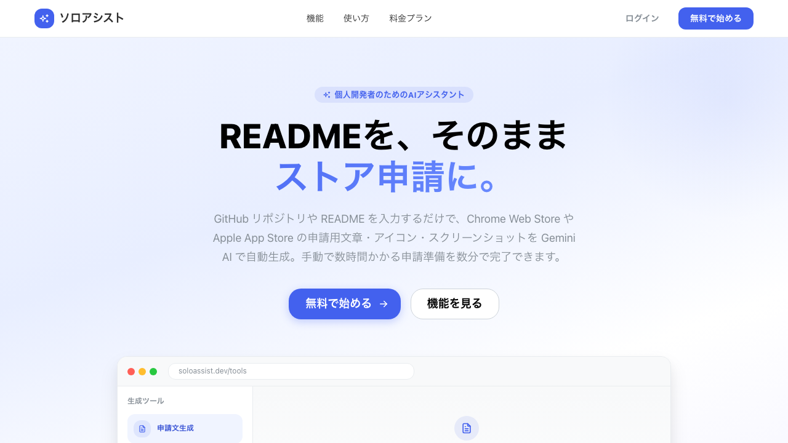
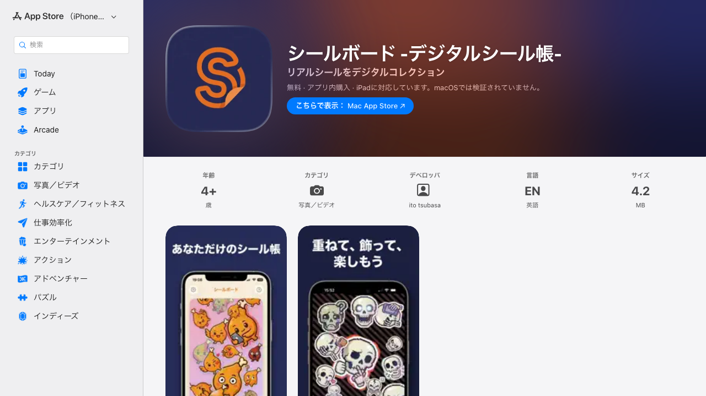
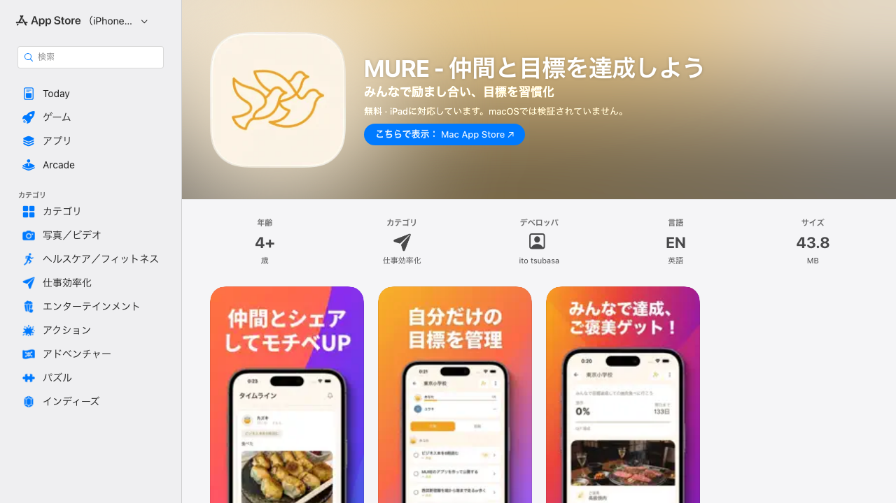
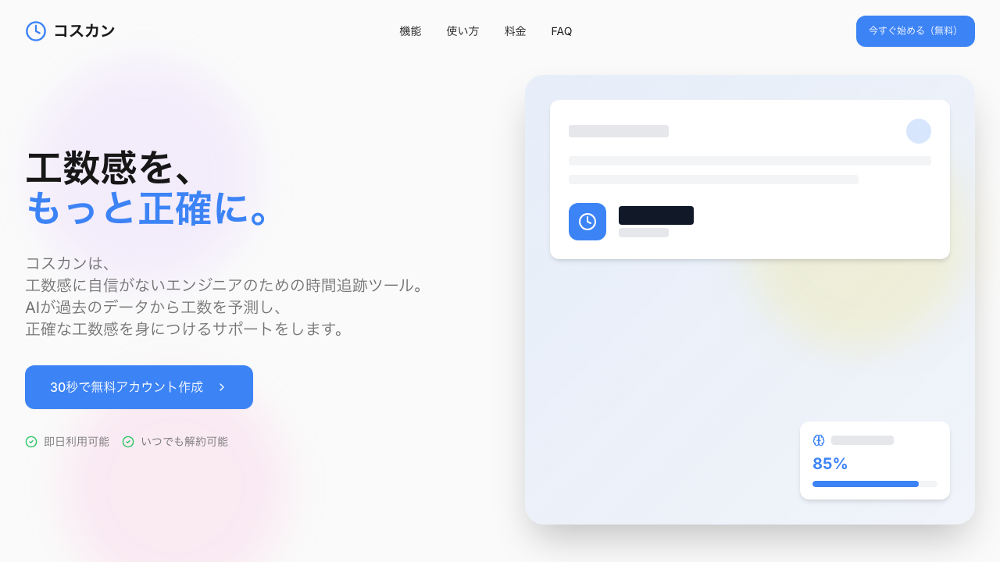

# イトウ ツバサ（てば） | 個人開発者

**「作りたいものを、作りたいときに、作る」**

個人開発が大好きなエンジニア/PMです。アイデアを形にして世の中に届けることにやりがいを感じています！

## 作ったもの

### 公開中

| <a href="https://colorfree-map.com/">バッチャンネル</a> | <a href="https://chromewebstore.google.com/detail/lofi-bgm-player/jdcppdokgfbnhiacbeplahgnciahnhck?authuser=0&hl=ja">Lofi BGM Player</a> |
| :--: | :--: |
|  |  |
| プログラミング・Web開発・ライフスタイルについて 発信するブログサイト | バックグラウンドでローファイBGMを再生する Chrome拡張機能 |
|     |     |

| <a href="https://apps.apple.com/jp/app/giftreee-%E3%82%AE%E3%83%95%E3%83%88%E7%AE%A1%E7%90%86%E3%81%A8ai%E6%8F%90%E6%A1%88%E3%82%A2%E3%83%97%E3%83%AA/id6754189163">Giftreee</a> | <a href="https://apps.apple.com/us/app/%E3%83%9E%E3%83%83%E3%83%81%E9%A3%AF-%E3%81%AA%E3%82%93%E3%81%A7%E3%82%82%E3%81%84%E3%81%84%E5%A4%96%E9%A3%9F%E3%82%92%E6%A5%BD%E3%81%97%E3%81%8F/id1665460630">マッチ飯</a> |
| :--: | :--: |
|  |  |
| 過去の傾向からAIと一緒に 大切な人への贈り物を考えるモバイルアプリ | 「今日何食べる？」を解決するモバイルアプリ |
|    |   |

| <a href="https://nani-poke.vercel.app/">PokeQuiz</a> | <a href="https://soloassist.dev/">ソロアシスト</a> |
| :--: | :--: |
|  |  |
| ポケモンの『分類』から ポケモンを当てるクイズアプリ | READMEを入力するだけで ストア申請用素材をAIで自動生成 |
|    |    |

| <a href="https://apps.apple.com/jp/app/%E3%82%B7%E3%83%BC%E3%83%AB%E3%83%9C%E3%83%BC%E3%83%89-%E3%83%87%E3%82%B8%E3%82%BF%E3%83%AB%E3%82%B7%E3%83%BC%E3%83%AB%E5%B8%B3/id6761348084">シールボード</a> | <a href="https://apps.apple.com/jp/app/mure-%E4%BB%B2%E9%96%93%E3%81%A8%E7%9B%AE%E6%A8%99%E3%82%92%E9%81%94%E6%88%90%E3%81%97%E3%82%88%E3%81%86/id6759218437">MURE</a> |
| :--: | :--: |
|  |  |
| リアルシールをデジタルコレクション あなただけのシール帳を作ろう | 仲間と励まし合いながら 目標を習慣化するモバイルアプリ |
|   |    |

### 過去に作ったもの

| コスカン |
| :--: |
|  |
| AIを活用した工数予測ツール 見積もり精度の向上をサポート ※ 現在は運用を終了しています |
|    |

## 技術スタック

**言語**: TypeScript / JavaScript / Swift / PHP / Dart

**フロントエンド**: React / Next.js / Vue.js / React Native / Flutter

**バックエンド**: Laravel

**インフラ**: AWS / Firebase / Vercel / Netlify

## 本業

千株式会社で「はいチーズ！アルバム」のWebエンジニア・PMをしています（2021年新卒入社）

## リンク

